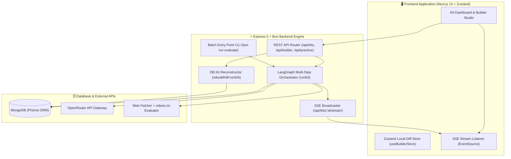

# AI Interview Prep — Backend Engine

[](https://github.com/jamesnagar11/interview-prep-backend)

The backend engine for **AI Interview Prep** is built with Bun, Node.js, Express 5, LangGraph, and MongoDB. It ingests Job Descriptions (JDs) and company URLs, crawls public web content while respecting `robots.txt`, extracts core job requirements using LLM analysis, runs gap-coverage verification, and orchestrates custom interview preparation kits (question banks, 3D flashcards, and interleaved study plans).

> ℹ️ **Complementary Frontend Repository**: This backend pairs with the Next.js frontend application hosted at [https://github.com/jamesnagar11/interview-prep](https://github.com/jamesnagar11/interview-prep). Please see the setup section below for instructions on running both services locally.

---

## Table of Contents

1. [Project Overview & Chosen Tech Stack](#project-overview--chosen-tech-stack)
2. [Setup Instructions (Local & Deployed)](#setup-instructions-local--deployed)
   - [Local Backend Setup](#local-backend-setup)
   - [Partner Frontend Setup](#partner-frontend-setup)
   - [Batch Entry Point (Evaluation CLI)](#batch-entry-point-evaluation-cli)
   - [Deployed Setup](#deployed-setup)
3. [LLM Provider and Model Configuration](#llm-provider-and-model-configuration)
4. [High-Level Architecture](#high-level-architecture)
5. [Retrieval Approach & Sources Used](#retrieval-approach--sources-used)
6. [Sequencing of Research and Generation Steps](#sequencing-of-research-and-generation-steps)
7. [Coverage Pass Decision (`MAX_COVERAGE_PASSES = 3`)](#coverage-pass-decision-max_coverage_passes--3)
8. [Representation of Generated, Edited, and Pinned State](#representation-of-generated-edited-and-pinned-state)
9. [Schedule Allocation Algorithm](#schedule-allocation-algorithm)
10. [Creative Features](#creative-features)
    - [Interactive 3D Flashcards Studio](#interactive-3d-flashcards-studio)
    - [Mock Exam Simulation & AI Coaching Engine](#mock-exam-simulation--ai-coaching-engine)
11. [Edge Cases and Failure Handling](#edge-cases-and-failure-handling)
12. [Key Design Decisions, Trade-offs & Limitations](#key-design-decisions-trade-offs--limitations)

---

## Project Overview & Chosen Tech Stack

### Tech Stack Summary
- **Runtime**: [Bun](https://bun.sh/) (v1.2+) & Node.js engine
- **Framework**: Express 5 REST API
- **Graph Orchestration**: Custom multi-step pipeline powered by LangGraph (`StateGraph`)
- **Database & ORM**: MongoDB via `@prisma/orm-mongo`
- **LLM Gateway**: OpenRouter API (`openai/gpt-4o-mini` / `google/gemini-2.5-flash`)
- **Web Retrieval**: `cheerio` HTML parser + `robots-parser` site terms evaluator
- **Validation & Schemas**: `zod` schema enforcement

### Tech Stack Justification
1. **Bun Runtime**: Provides ultra-fast cold starts, native TypeScript execution without transpilation steps, and fast module resolution compared to traditional `ts-node`.
2. **LangGraph Pipeline Architecture**: Allows modular, fan-out parallel execution (e.g., parallel retrieval and requirement extraction, parallel category question generation) while supporting deterministic loopbacks for coverage gap-filling.
3. **MongoDB + Relational Adapters**: Interview prep kits contain structured document trees (roles, requirements, questions, flashcards, schedule days) with relational join dependencies (e.g., `QuestionRequirement`). Storing normalized entities while caching the assembled JSON blob (`kit.result`) gives both fast relational query power for Builder Mode edits and instant full-kit reads.

---

## Setup Instructions (Local & Deployed)

### Prerequisites
- Node.js (v18+)
- Bun (`npm install -g bun`)
- MongoDB (Running locally via Docker or local installation)

```bash
# Start MongoDB locally via Docker (if no local MongoDB service is running)
docker run -d --name mongo -p 27017:27017 mongo:latest
```

---

### Local Backend Setup

1. **Clone the Backend Repository**:
   ```bash
   git clone https://github.com/jamesnagar11/interview-prep-backend
   cd interview-prep-backend
   ```

2. **Configure Environment Variables**:
   Copy `.env.example` to `.env`:
   ```bash
   cp .env.example .env
   ```
   Configure the following key variables in `.env`:
   ```env
   PORT=5000
   DATABASE_URL="mongodb://localhost:27017/ai_interview_prep"
   OPENROUTER_API_KEY="your_openrouter_api_key_here"
   JWT_SECRET="your_secure_jwt_secret"
   ```

3. **Install Dependencies & Build**:
   ```bash
   bun install
   bun run build
   ```

4. **Run Server**:
   - **Development (Hot-Reload)**:
     ```bash
     bun run dev
     ```
   - **Production Mode**:
     ```bash
     bun run start
     ```
   The backend server runs at `http://localhost:5000`.

---

### Partner Frontend Setup

To launch the complete application UI:

1. **Clone the Client Repository**:
   ```bash
   git clone https://github.com/jamesnagar11/interview-prep
   cd interview-prep
   ```

2. **Configure Environment Variables**:
   ```bash
   cp .env.example .env
   ```
   Set `NEXT_PUBLIC_API_URL="http://localhost:5000"` in `.env`.

3. **Install & Run Frontend**:
   ```bash
   npm install
   npm run dev
   ```
   Open `http://localhost:3000` in your browser.

---

### Batch Entry Point (Evaluation CLI)

The backend includes a dedicated batch entry point CLI to run automated, offline pipeline quality and coverage evaluation across multiple test cases without modifying database state (`EVAL_MODE=true`).

#### Exact Command to Run Batch Evaluation:

```bash
# Run batch evaluation against default test cases (cases.jsonl)
bun run evaluate

# Or specify a custom JSONL test cases file:
bun run evaluate ./src/eval_cases.jsonl
```

#### What the Batch Entry Point Does:
- Reads input test cases containing `job_description`, `company_url`, and target `days`.
- Executes the full research, requirement extraction, parallel question generation, gap coverage loop, flashcard assembly, and schedule interleaving pipeline.
- Validates that every must-have requirement is tracked and satisfied.
- Prints a structured `console.table` summary report detailing total requirements, questions generated, flashcards, schedule days, uncovered must-haves, and `PASS`/`FAIL` status. Exits with code `0` on clean passing evaluations and code `1` if uncovered must-haves remain.

---

### Deployed Setup

- **Backend Deployment (Railway / Render / AWS)**:
  - Set Environment Variables: `DATABASE_URL`, `OPENROUTER_API_KEY`, `JWT_SECRET`, `NODE_ENV=production`.
  - Build command: `bun run build`
  - Start command: `bun run start`
- **Database**: Host MongoDB on MongoDB Atlas or a dedicated container instance. Ensure the connection string format handles replica sets (`mongodb+srv://...`).

---

## LLM Provider and Model Configuration

- **Provider Gateway**: OpenRouter API (`https://openrouter.ai/api/v1`)
- **Primary Model**: `openai/gpt-4o-mini` (or `google/gemini-2.5-flash`)
- **Configuration Rationale**:
  - Selected for high structured JSON compliance, low latency completion response times (~10–15 seconds total per category generation call), and substantial context window capacity.
  - Cost-effective for multi-pass gap filling loops.
  - Fallback logic switches automatically to `google/gemini-2.5-flash` or `deepseek/deepseek-r1` if rate limits or 5xx provider outages occur.

---

## High-Level Architecture



---

## Retrieval Approach & Sources Used

### Ethical Crawling & Compliance
- Uses `robots-parser` to parse and respect the target domain's `robots.txt` before fetching.
- Identifies with a clean user-agent header (`AIPrepBot/1.0 (+http://localhost:3000)`).
- Enforces strict request timeouts (10 seconds) and limits total fetched payload size to 250KB per page.

### Crawling Sequence & Sources:
1. **Target URLs**: Company homepage, `/about`, `/careers`, `/hiring`, `/culture`, `/jobs`.
2. **Text Parsing**: Uses `cheerio` to strip script, style, SVG, navigation, and footer tags. Extracts clean semantic article text, heading hierarchies, and paragraph strings.
3. **Fallbacks**: If the provided URL returns a 404, times out, or blocks scraping via `robots.txt`, the pipeline gracefully falls back to extracting company domain signals from the Job Description text itself.

---

## Sequencing of Research and Generation Steps

The generation pipeline executes as an asynchronous LangGraph execution graph across distinct nodes:

```
START 
  ├──> researchNode (Fetch company site & hiring process details)
  └──> extractNode  (Parse JD into seniority, title, and 6–10 consolidated core requirements)
        │
        ▼
   mergeNode        (Combine research bundle & requirement spectrum)
        │
        ├──> briefNode          (Generate company summary & culture brief)
        └──> questionGenNode    (Parallel generation across categories: technical, system-design, behavioural, company-fit)
               │
               ▼
         coverageCheckNode      (Check mapping of must-have requirements)
               │
               ├── [Gaps exist & Passes < 3] ──> generateGapQuestionsNode ──┐
               │                                                            │
               └── [No gaps OR Max Passes reached] <────────────────────────┘
                       │
                       ▼
                 flashcardNode          (Code-derived question-to-flashcard conversion)
                       │
                       ▼
                 scheduleNode           (Round-Robin interleaved timeline allocation)
                       │
                       ▼
                 assembleNode & validateNode (Zod schema verification)
                       │
                       ▼
                 persistNode            (Write to MongoDB & publish READY status)
                       │
                       ▼
                      END
```

### Node Responsibilities:
1. `researchNode`: Discovers company background and hiring format text.
2. `extractNode`: Consolidates multi-page job descriptions into 6 to 10 high-signal requirements grouped into `technical`, `domain`, `behavioural`, and `culture` types with `must`, `should`, or `nice` priority ratings.
3. `briefNode`: Formulates executive company summary and mission statements.
4. `questionGenNode`: Generates targeted interview questions per category with detailed evaluation outlines (`answer_outline`) and 1-3 difficulty ratings.
5. `coverageCheckNode`: Analyzes requirement coverage matrices.
6. `generateGapQuestionsNode`: Targeted secondary pass to cover any missing `must-have` requirement.
7. `flashcardNode`: Code-derived conversion of questions into interactive flashcards without unnecessary LLM overhead.
8. `scheduleNode`: Interleaves questions into daily study modules.
9. `persistNode`: Persists normalized entities to MongoDB and serializes full result JSON.

---

## Coverage Pass Decision (`MAX_COVERAGE_PASSES = 3`)

### Rule Enforcement:
*"A kit that ships with uncovered must-have requirements has failed at the one job it had."*

### Why 3 Passes?
1. **Pass 1 (Initial Category Generation)**: Standard parallel generation across categories covers 90%+ of requirements in well-formed job descriptions.
2. **Pass 2 (Targeted Gap Injection)**: Any uncovered `must-have` requirement triggers `generateGapQuestionsNode`. The LLM is provided with the exact text of the missing requirement and instructed to generate specific questions targeting it.
3. **Pass 3 (Final Recovery Pass)**: Handles lingering edge-case requirements or rare JSON parsing errors.
4. **Stopping Condition & Defense**: If a requirement remains uncovered after 3 passes, further LLM loops yield diminishing returns (usually indicating a contradictory or nonsensical JD snippet). Rather than risking infinite recursion or API timeout, the pipeline records the requirement ID in `uncoveredRequirement` join tables and reports it transparently in `_meta.warnings` so the user is informed.

---

## Representation of Generated, Edited, and Pinned State

To solve the partial-regeneration state protection challenge, each question and flashcard maintains an explicit `state` tri-state enum field:

```typescript
type ItemState = "GENERATED" | "EDITED" | "PINNED";
```

### State Behavior Rules:
1. **`GENERATED`**: Default state for LLM-created items. Subject to deletion or replacement when the user clicks "Regenerate Category".
2. **`EDITED`**: Assigned automatically whenever a user modifies the question prompt, answer outline, category, or difficulty in Builder Mode.
3. **`PINNED`**: Assigned when a user explicitly pins an item using the pin toggle button.

### Category Regeneration Algorithm:
When `POST /api/kits/:id/regenerate/questions/:category` is invoked:
- Existing questions in that category are queried from MongoDB.
- Items are split into `keep` (`state === 'EDITED' || state === 'PINNED'`) and `replace` (`state === 'GENERATED'`).
- Only items in the `replace` set are deleted from MongoDB.
- The LLM generates replacement questions for the remaining gap quota.
- User hand-edited and pinned questions are **strictly preserved in place**, maintaining their position and order.

---

## Schedule Allocation Algorithm

Study schedules (1 to 70 days) are constructed using a pure code **Round-Robin Interleaved Distribution Algorithm** (zero additional LLM cost):

1. **Clamping**: Input days are clamped between 1 and 70 (`days > 70` returns HTTP 400).
2. **Sorting**: Questions are sorted by priority (`must` > `should` > `nice`) and difficulty (harder questions assigned earlier in the study plan).
3. **Interleaving**: Questions are rotated across categories (`technical` -> `behavioural` -> `system-design` -> `company-fit`) and distributed across study days to ensure balanced daily study loads.
4. **Time Budgeting**: Assigns study minutes per day based on difficulty (Difficulty 1 = 15m, 2 = 25m, 3 = 40m).
5. **Spaced Repetition Review**: Short schedules (fewer questions than days) automatically create buffer review days using must-priority questions for spaced repetition.

---

## Creative Features

### Interactive 3D Flashcards Studio
- **Flip Animations & Studio Interface**: Full 3D CSS card flipping for quick-fire concept reviews.
- **Confidence-Weighted Queue**: Flashcards are prioritized dynamically based on user self-ratings (1–10 confidence scale) and review staleness, prioritizing low-confidence and unrated cards first.

### Mock Exam Simulation & AI Coaching Engine
- **Full Exam Simulation**: Interactive timer, question navigation, flag toggling, and note taking.
- **AI Coach Evaluation**: Analyzes user performance, confidence scores, and notes to generate an executive AI report card complete with overall score (0–100), letter grade (A+ to F), key strengths, areas to improve, next steps, and a motivational closing note.
- **Exportable HTML/PDF Reports**: One-click generation of formatted exam reports for offline review or sharing.

---

## Edge Cases and Failure Handling

| Edge Case / Failure | Handling & Resolution Approach |
|---|---|
| **1. Invalid / 404 / Timeout Company URL** | Web fetcher catches HTTP/network errors, logs a non-fatal retrieval warning, and falls back to extracting company domain signals directly from the Job Description text. |
| **2. Company Site Has No Discoverable Hiring/About Page** | Crawling logic degrades gracefully, skipping research context injection while allowing requirement extraction and question generation to proceed unhindered. |
| **3. Two-Line Stub Job Description** | Requirement extraction node detects sparse text, synthesizes core implied expectations based on job title, attaches a warning (`"Sparse job description provided..."`), and generates a baseline prep kit. |
| **4. Public Discussion Turns Up Nothing** | System relies strictly on internal LLM knowledge for known industry practices corresponding to the specified role title and seniority level. |
| **5. Model Returns Invalid JSON or Incomplete Kit** | All LLM responses pass through Zod schema validation. Formatting errors trigger automated fallback repair parsing or a structured retry with explicit JSON instructions. |
| **6. LLM Rate-Limiting or Brief Provider Failures** | Wrapped with exponential backoff retries (`http_client` helper with 3 retries) and automatic failover to secondary provider models. |
| **7. Duplicate Job Description + Company Submitted** | Computes a SHA-256 hash (`jdText + companyUrl`). Re-submitting identical inputs returns the existing in-flight or completed `kitId` immediately (`200 OK`, `deduplicated: true`). |
| **8. 1-Day or 60/70-Day Schedule Requests** | Schedules are clamped to 1–70 days. 1-day requests compress all core questions into an intensive cram session; 60/70-day requests interleave spaced repetition review slots. |
| **9. 90-Second Slow / Mid-Generation Failure** | Kits process asynchronously in background worker queues (`runKit`). Frontend connects via Server-Sent Events (SSE) to receive real-time step progress logs. If a node fails, status updates to `FAILED` with actionable error details. |
| **10. Double Triggering of Same Posting** | Idempotency deduplication check at `POST /api/kits` prevents duplicate background pipeline executions, returning the active `kitId`. |

---

## Key Design Decisions, Trade-offs & Limitations

1. **Tri-State In-Memory Local Diffing vs Server Roundtrips**:
   - *Decision*: In Builder Mode, the client buffers user edits in a local Zustand diff state (`diff: BuilderDiff`) and renders derived previews instantly. Server persistence occurs on clicking "Save Changes".
   - *Trade-off*: Reduces network payload traffic and database write frequency, but requires dirty state unload guards (`beforeunload`) to prevent unsaved change loss.
2. **Code-Derived Flashcards**:
   - *Decision*: Deriving flashcards directly from generated questions saves completion token costs and guarantees requirement mapping alignment.
   - *Limitation*: Flashcards mirror question prompts rather than presenting entirely distinct trivia questions.
3. **Synchronous Category Regeneration**:
   - *Decision*: Single-category regeneration endpoints execute synchronously within standard HTTP requests (~2–4s) rather than background SSE streams, providing simpler request-response UX.

---

## Summary of Assignment Requirements Coverage

| Requirement | Implementation Detail | Location in Codebase |
|---|---|---|
| **Tech Stack & Justification** | Bun, Express 5, LangGraph, Prisma MongoDB, OpenRouter | `backend/README.md`, `backend/package.json` |
| **Setup & Batch Entry Point** | `bun run evaluate [cases.jsonl]` batch CLI | [`backend/src/evaluate.ts`](file:///d:/me/ai-interview-prep/backend/src/evaluate.ts) |
| **LLM Provider & Model** | OpenRouter gateway (`openai/gpt-4o-mini`) | `backend/src/services/` |
| **Retrieval & Site Terms** | `cheerio` + `robots-parser` compliance | [`backend/src/services/crawl/`](file:///d:/me/ai-interview-prep/backend/src/services/crawl/) |
| **LangGraph Pipeline Sequence** | 11-step execution graph | [`backend/src/services/kits/kitRunner.ts`](file:///d:/me/ai-interview-prep/backend/src/services/kits/kitRunner.ts) |
| **Tri-State Protection** | `GENERATED` / `EDITED` / `PINNED` state preservation | [`backend/src/services/kit/builderService.ts`](file:///d:/me/ai-interview-prep/backend/src/services/kit/builderService.ts) |
| **Coverage Pass Policy** | 3-pass gap filling loop with stopping logic | [`backend/src/services/kit/checkCoverage.ts`](file:///d:/me/ai-interview-prep/backend/src/services/kit/checkCoverage.ts) |
| **Interleaved Schedule** | Round-Robin difficulty & category allocation | [`backend/src/services/kit/buildSchedule.ts`](file:///d:/me/ai-interview-prep/backend/src/services/kit/buildSchedule.ts) |
| **Edge Cases (All 10)** | Comprehensive fallback & retry matrix | Detailed in section 11 above |
